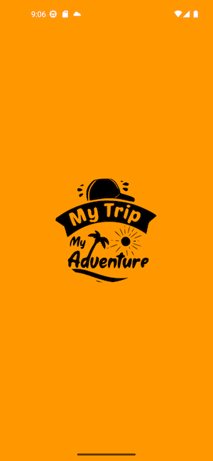
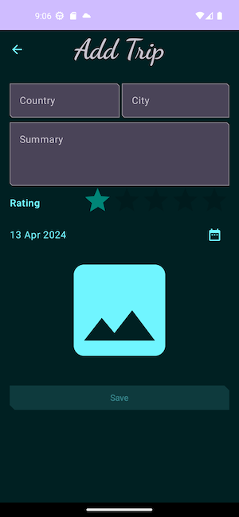

# LovelyTrip App

Welcome to LovelyTrip! This is a mobile app that allows users to save and plan their trips, providing features to record trip details such as country, city, date, summary, and images.

## Features

- **Save Trip Details**: Record details of your trips, including country, city, and date.
- **Add Summary**: Write a summary for each trip to capture memorable moments.
- **Upload Images**: Attach images to your trips to visually document your experiences.
- **User-Friendly Interface**: Simple and intuitive interface for easy trip management.

## Screenshots

Here are some screenshots from the LovelyTrip app:

*Add a new trip*

*View trip details*

## Tools and Dependencies

LovelyTrip is built using the following tools and libraries:

- **Kotlin**: Main programming language for Android development.
- **Jetpack Components**: Android Jetpack libraries for architecture components, navigation, and more.
- **Room**: Persistence library used for managing local database storage.
- **Splash Screen**: Implemented a splash screen for app loading.
- **Dialog Core and Calendar**: Libraries for displaying dialogs and calendar components.
- **Coil**: Image loading library for handling image loading and caching efficiently.

## Installation

To install LovelyTrip on your Android device, follow these steps:

1. Clone this repository.
2. Open the project in Android Studio.
3. Connect your Android device.
4. Build and run the app.

## Usage

Once installed, follow these steps to start using LovelyTrip:

1. Open the app.
2. Click on the "+" button to add a new trip.
3. Enter trip details and save.
4. View and manage your trips from the main screen.

## Feedback

We hope you enjoy using LovelyTrip! If you have any feedback or suggestions for improvement, please feel free to [open an issue](https://github.com/yourusername/lovelytrip-app/issues) on GitHub.

## Contributing

Contributions are welcome! If you'd like to contribute to LovelyTrip, please follow our [contribution guidelines](CONTRIBUTING.md).

## License

This project is licensed under the [MIT License](LICENSE).

---

Developed with ❤️ by [PRG](https://github.com/YahefuYusufu)
